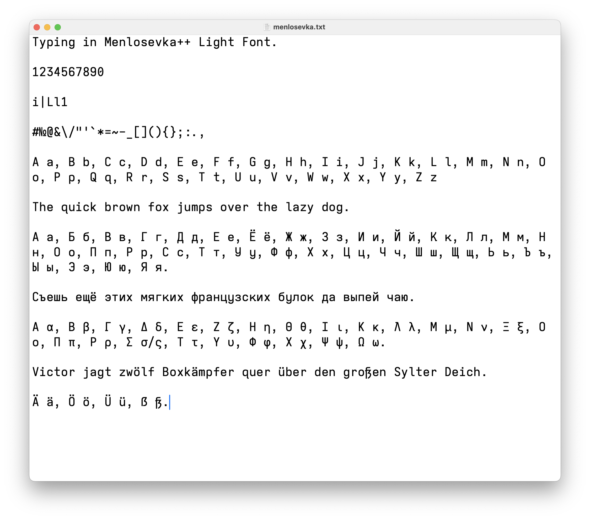
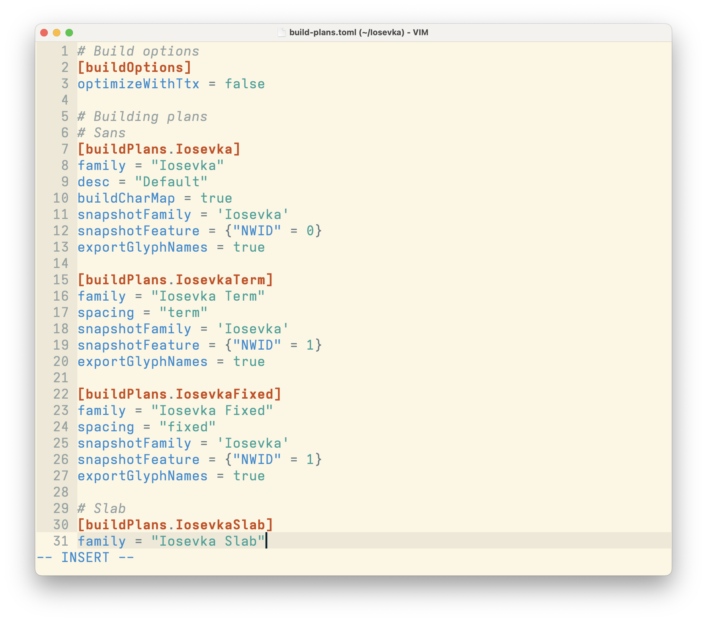
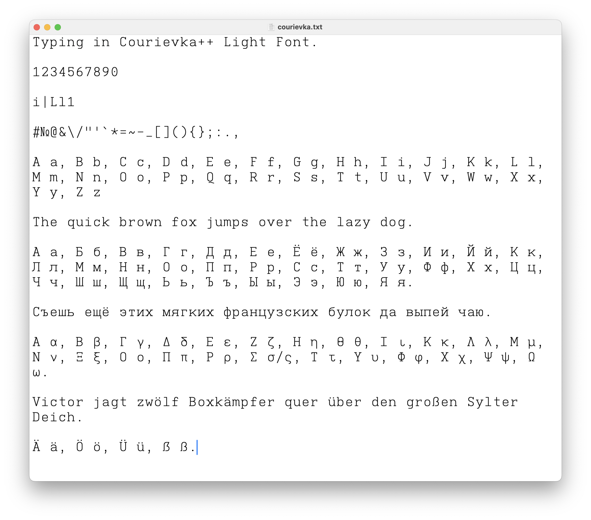
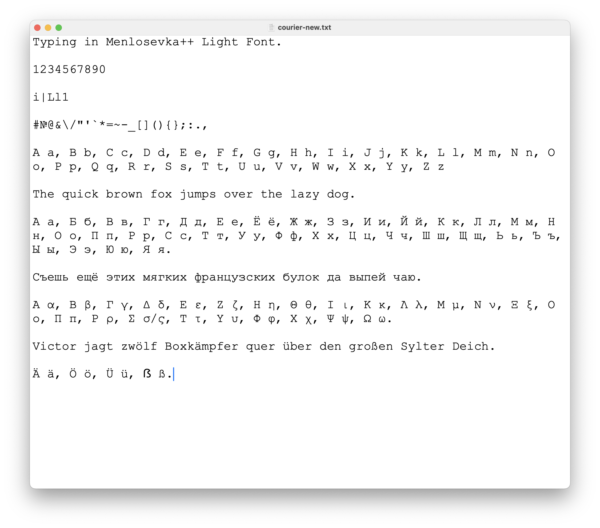

# Personal font configuration

My fonts are based on the great [Iosevka](https://typeof.net/Iosevka/) project.

## Menlosevka++

I like Apple™ **Menlo** font, but always thought that it can be greatly improved with ligatures support and other small tweaks.

So I made it.

### Showcase

| Menlosevka++                              | Menlosevka in MacVim                                |
| ----------------------------------------- | --------------------------------------------------- |
|  |  | 

## Courievka++

I also really like **Courier New** font, but have never found a modern replacement that would tick all the boxes, like supporting cyrillic, math symbols, having width and weight variation, etc.

So I also made it.

### Showcase

| Courievka++                             | Courier New                               |
| --------------------------------------- | ----------------------------------------- |
|  |  |

